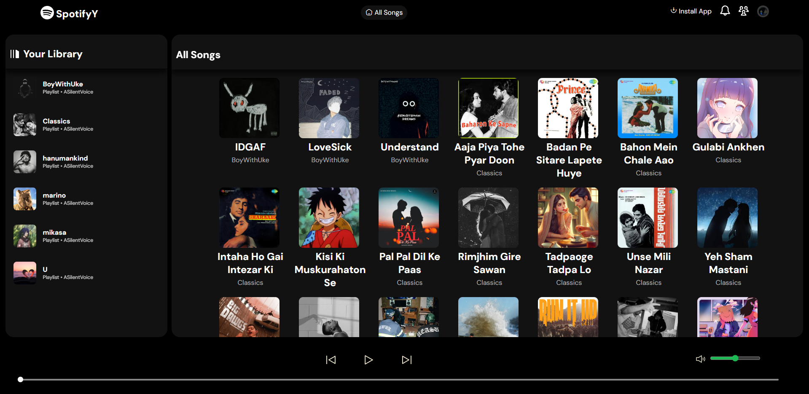
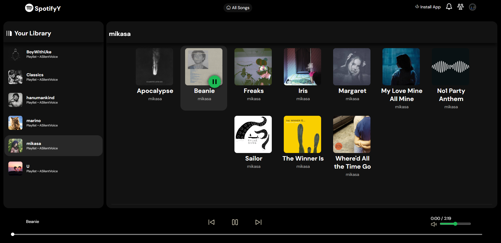
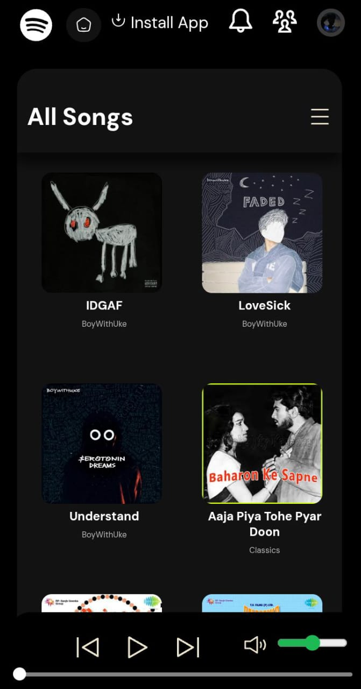
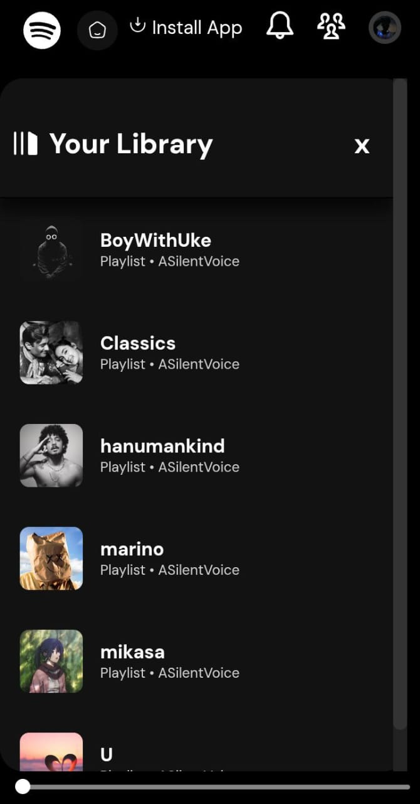
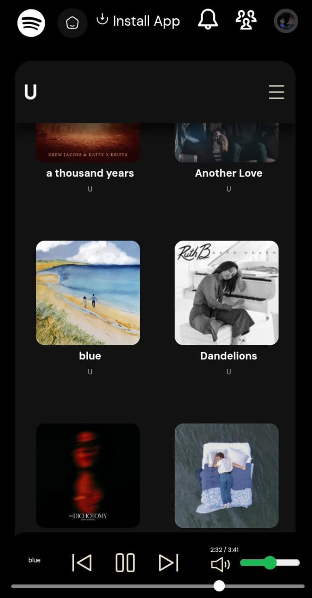

# 🎵 SpotifyY

A clean, responsive, JavaScript-based music player that supports playlists, song previews, and basic controls. It loads songs dynamically from a JSON file and displays them beautifully.

---

## 🚀 Features

* 🎧 Play / Pause / Next / Previous
* 📁 Playlist loading from `songs.json`
* 🕒 Real-time seek bar and time display
* 🔊 Volume control with mute toggle
* ⌨️ Spacebar to toggle play/pause
* 📱 Mobile responsive with side navigation
* 👤 Click-to-toggle profile dropdown

---

## 📁 Folder Structure

```
project-root/
├── index.html
├── script.js
├── style.css
├── songs.json
├── img/
│   └── songs/
│       ├── Playlist1/
│       │   ├── pllogo.jpg
│       │   ├── song1.mp3
│       │   ├── song1.jpg
│       │   └── ...
│       └── Playlist2/
│           ├── pllogo.jpg
│           ├── song2.mp3
│           ├── song2.jpg
│           └── ...
├── svg/
│   ├── play.svg
│   ├── pause.svg
│   ├── volume.svg
│   └── mute.svg
```

---

## 📄 `songs.json` Format

```json
{
  "Playlist1": [
    "songs/Playlist1/song1.mp3",
    "songs/Playlist1/song2.mp3"
  ],
  "Playlist2": [
    "songs/Playlist2/track1.mp3"
  ]
}
```

> 🎨 Note: For every `.mp3`, a `.jpg` image (same name) should exist in the same folder.

---

## 🛠 How to Use — quick web usage

This project is designed to be used as a hosted web app (example: `https://spotify-y.vercel.app/`). Below are the **site-specific behaviors** you’ll see on desktop vs mobile — concentrate on the UI differences and how playlists are accessed.

### ✅ Desktop (PC) — site behavior

1. **Open the hosted site** in your browser (Chrome, Firefox, Edge, etc.).
2. **Left sidebar — Your Library:** playlists appear in a persistent left column (library). Use this to navigate between playlists.
3. **View playlist:** clicking any playlist in the left sidebar filters the main grid to show only songs from that playlist.
4. **Return to All Songs:** click the **home / All Songs** button or the site logo at the top to reset the view and show every song again.
5. **Play a song:** click a song card in the main grid — the bottom player will show playback controls, seek bar and volume.
6. **Keyboard:** Spacebar toggles Play/Pause; media keys (if available) also work.

### ✅ Phone (Mobile) — site behavior

1. **Open the hosted site** in your mobile browser (Chrome or Safari recommended).
2. **Hamburger (Library) menu:** on mobile there is a hamburger icon (top-right). Tap it to open **Your Library** — this drawer contains your playlists.
3. **Tap a playlist:** selecting a playlist from the drawer filters the main view to show only that playlist's songs (same behavior as desktop filtering).
4. **Return to All Songs:** tap the **All Songs** label or the Home icon to go back to the full library.
5. **Start playback:** mobile browsers require a user tap to begin audio — just tap a song card to play. Controls appear at the bottom of the screen.

> Note: This README focuses on the hosted-site experience — if you do want to run the project locally for development, a short note is at the end of the repo, but the UI behavior described above is the same when the site is served.

## 🎛 Behavior details (UX)

* **Playlist filtering:** when you click/tap a playlist (in the left sidebar on PC or the hamburger library on mobile), the main grid updates to show only the songs that belong to that playlist.
* **Return to All Songs:** there is a Home / All Songs button — tap it to reset the view and show all songs again.
* **Mobile library:** the extra hamburger icon on mobile opens the library drawer that contains the playlists (as seen in screenshots). This mimics a native app drawer.

---

## ❤️ My Favorite Songs

This section is reserved for your personal favorites. (No song names are listed here by default.)

* To add your favourites to the README, you can either:

  * Paste a short list of song titles below this heading, or
  * Add a `Favorites` playlist entry to `songs.json` so it shows inside the app.

> Tip: If you want me to add a `Favorites` snippet to `songs.json`, I can generate it once you confirm the filenames.

---

## 🖼 Screenshots (add your images here)

Include screenshots to visually demonstrate the desktop and mobile behaviors. Recommended screenshots (filenames suggested):

1. **pc-main.png** — Desktop main view showing all songs and the left library.
2. **pc-playlist-open.png** — Desktop view after clicking a playlist (filtered view).
3. **mobile-home.png** — Mobile main screen (shows song grid and top bar with hamburger icon).
4. **mobile-library.png** — Mobile library drawer open (shows playlists list).
5. **mobile-playing.png** — Mobile player in playing state (bottom controls + lock-screen/notification sample if available).

### How to embed screenshots in this README

Place your images in the repo (recommended path: `docs/screenshots/`) then embed using Markdown, for example:

```markdown
### Desktop — All songs


### Desktop — Playlist filtered


### Mobile — Home


### Mobile — Library drawer


### Mobile — Playing

```

**Image recommendations:** JPG or PNG, width \~1200px for desktop screenshots, \~800px for mobile. Name images exactly (no spaces) to keep the markdown simple.

---

## 🔧 Adding `Favorites` to `songs.json`

To make the favorites show up inside the player, add a `Favorites` key to your `songs.json`. Example:

```json
{
  "Favorites": [
    "songs/PlaylistA/songA.mp3",
    "songs/PlaylistB/songB.mp3"
  ],
  "PlaylistA": [
    "songs/PlaylistA/songA.mp3"
  ]
}
```

Make sure file names and folders match the real files inside `img/songs/`.

---

## ⚠️ Troubleshooting

* **Player shows no songs** — check `songs.json` for valid JSON and correct file paths.
* **Images not loading** — ensure `.jpg` covers exist next to each `.mp3`.
* **No audio on mobile** — tap the player once (user gesture) to enable audio. Autoplay is blocked on mobile.

---

## 🔧 Customization

* Add playlists or songs via `songs.json`.
* Swap icons in `/svg/`.
* Modify colors and layout in `style.css`.

---

## 🧠 Technologies Used

* Vanilla JavaScript
* HTML5
* CSS3 (Flexbox, Media Queries)

---

If you want, I can now:

* Embed actual screenshots into the README for you — upload the images and I will insert the Markdown image tags in the correct places.
* Generate a ready-to-copy `songs.json` `Favorites` snippet using exact filenames from your repo if you confirm them.

Tell me which you want next.
